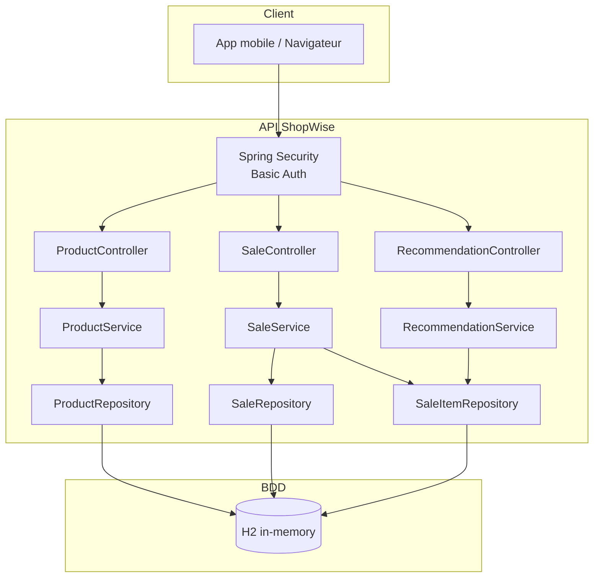
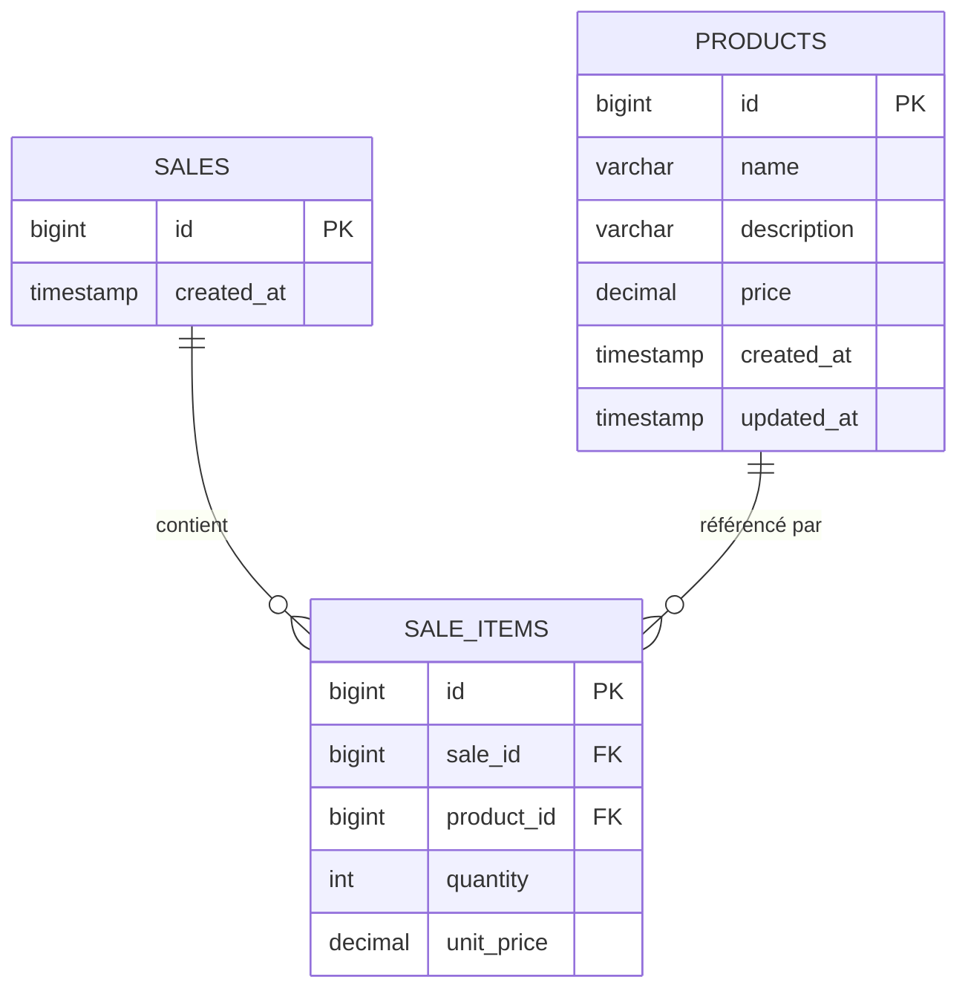
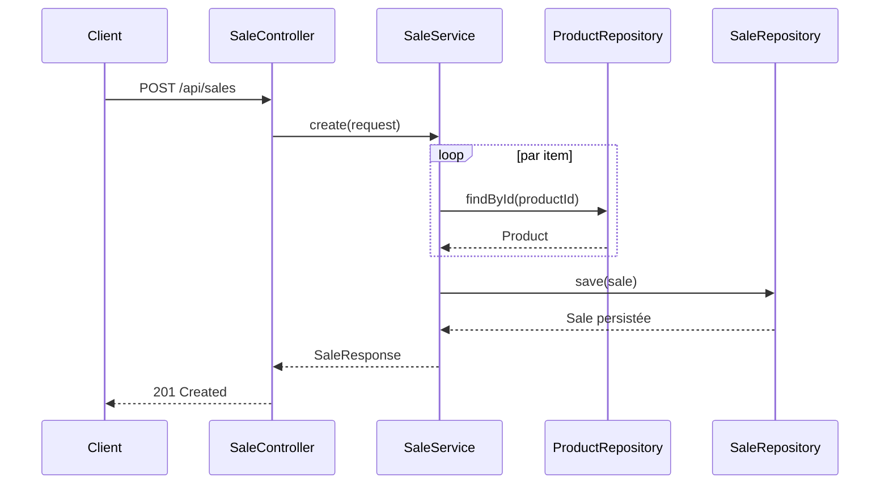

# ShopWise – Backend API

Projet réalisé dans le cadre du bloc 4 – Expert en Ingénierie du Logiciel.  
Stack : Spring Boot 4 · Java 21 · H2 (dev) · Spring Security

---

## Architecture

L'application suit une architecture en couches classique : **Controller → Service → Repository → BDD**.

J'ai choisi cette approche plutôt que microservices parce que ShopWise est encore en phase de démarrage. Découper en services trop tôt aurait ajouté de la complexité opérationnelle sans bénéfice réel (orchestration, réseau, latence inter-services). La modularité est déjà là via les packages, donc le découpage reste possible plus tard si la charge l'exige.

### Composants



### Modèle de données



> Le champ `unit_price` dans `SALE_ITEMS` permet de conserver le prix au moment de la vente, indépendamment des éventuelles modifications futures du catalogue.

### Séquence – Enregistrement d'une vente



---

## Algorithme de recommandation

### Top produits (`GET /api/recommendations/top?limit=N`)

On agrège le volume vendu par produit et on retourne les N premiers :

```
score(produit) = SUM(quantity) sur tous les SALE_ITEMS du produit
→ tri décroissant, retour des N premiers
```

C'est simple et efficace dès qu'on a un historique de ventes. Ça permet au commerçant de voir ses best-sellers rapidement.

### Produits achetés ensemble (`GET /api/recommendations/similar/{id}?limit=N`)

Principe de co-occurrence (market basket analysis basique) :

```
1. Trouver toutes les ventes contenant le produit P
2. Pour chaque autre produit Q présent dans ces mêmes ventes :
       score(Q) = nombre de ventes où P et Q apparaissent ensemble
3. Retourner les N produits Q avec le score le plus élevé
```

C'est le même principe que le "les clients ayant acheté X ont aussi acheté Y". Ça ne nécessite pas de modèle ML, les données de vente suffisent.

---

## Sécurité

Spring Security avec HTTP Basic Auth. Deux rôles :

| Rôle | Login | Accès |
|---|---|---|
| `ADMIN` | admin / shopwise123 | lecture + écriture |
| `USER` | user / user123 | lecture seule |

> En prod : passer sur JWT + BDD pour les utilisateurs + HTTPS obligatoire.

---

## Endpoints

**Produits**
- `GET /api/products` – liste tous les produits
- `GET /api/products/{id}` – détail d'un produit
- `POST /api/products` – créer (admin)
- `PUT /api/products/{id}` – modifier (admin)
- `DELETE /api/products/{id}` – supprimer (admin)

**Ventes**
- `POST /api/sales` – enregistrer une vente (admin)
- `GET /api/sales` – historique des ventes
- `GET /api/sales/{id}` – détail d'une vente

**Recommandations**
- `GET /api/recommendations/top?limit=5` – top produits
- `GET /api/recommendations/similar/{id}?limit=5` – produits souvent achetés ensemble

---

## Lancer le projet

```bash
# Maven
./mvnw spring-boot:run

# Docker
docker build -t shopwise-api .
docker run -p 8080:8080 shopwise-api

# Console H2 (dev uniquement)
# http://localhost:8080/h2-console
# JDBC URL : jdbc:h2:mem:shopwise
```

## Tests

```bash
./mvnw test
# rapport JaCoCo → target/site/jacoco/index.html
```

---

## Structure du projet

```
├── bdd/
│   ├── script.sql
│   └── schema base de données.pdf
├── couverture/
│   └── rapport-backend/       ← généré après mvn test
├── src/
│   ├── main/java/com/shopwise/app/
│   │   ├── config/            ← SecurityConfig
│   │   ├── controller/
│   │   ├── dto/
│   │   ├── entity/
│   │   ├── exception/
│   │   ├── mapper/
│   │   ├── repository/
│   │   └── service/
│   └── test/
├── Dockerfile
├── docker-compose.yml
└── pom.xml
```
